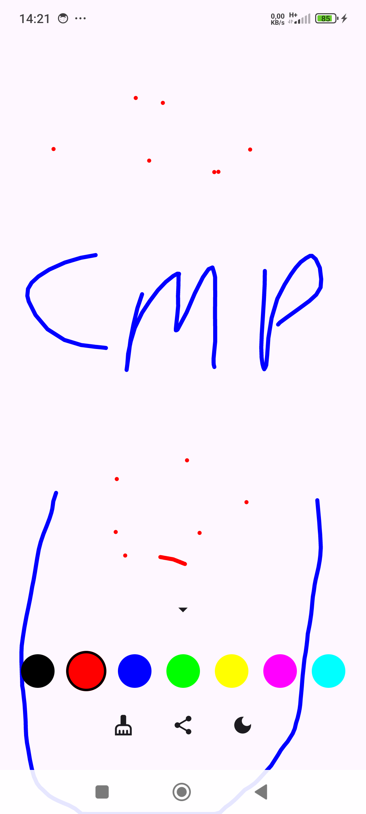
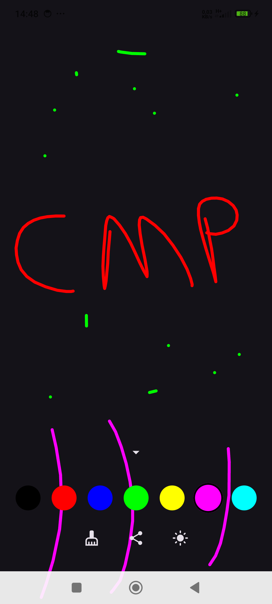
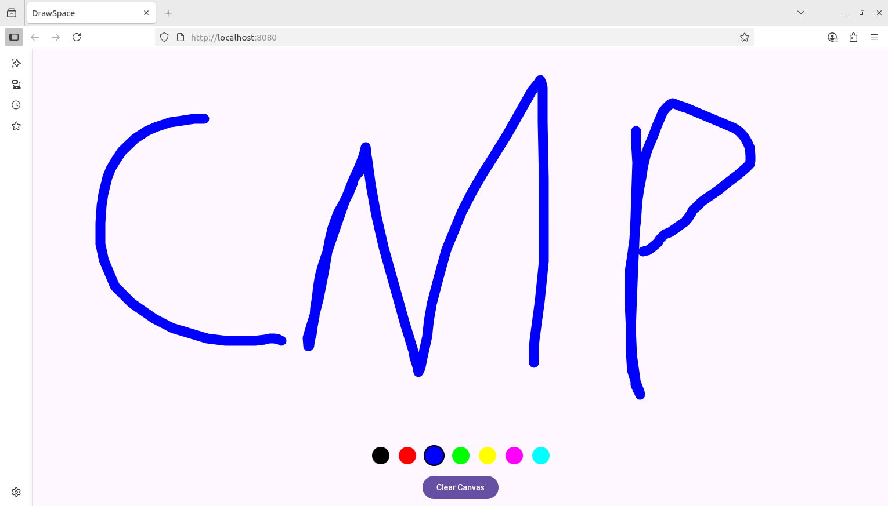
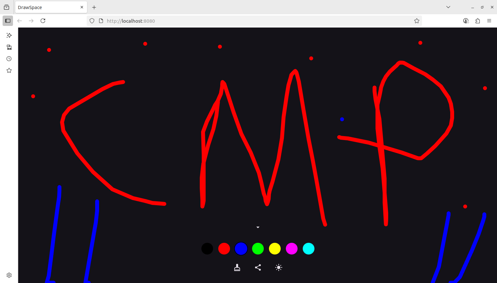
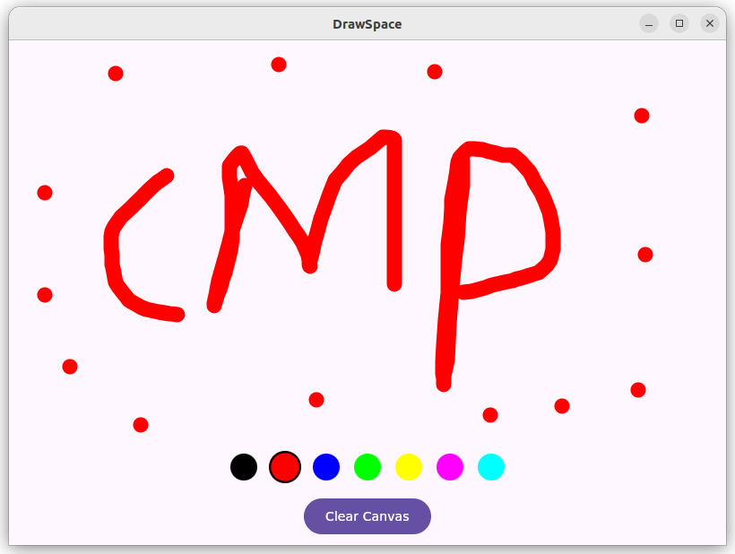
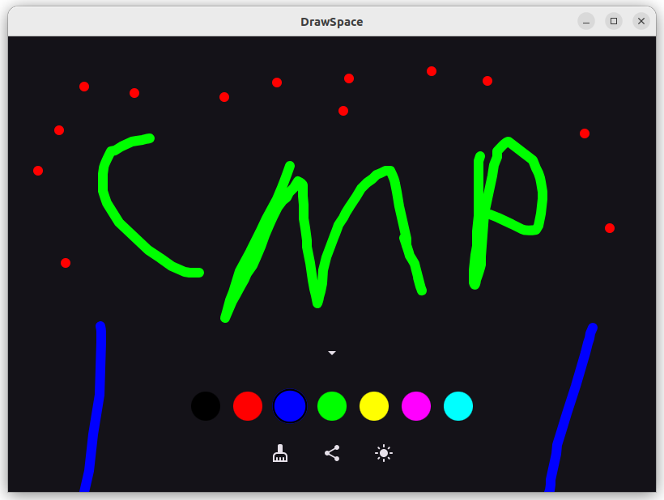

# DrawSpace CMP

A Kotlin Multiplatform project for drawing on Mobile, Web, and Desktop.

## Platform Demos

### Mobile
| Light                                                                       | Dark                                                                            |
|-----------------------------------------------------------------------------|---------------------------------------------------------------------------------|
|  |  |

### Web
| Light                                                                | Dark                                                                     |
|----------------------------------------------------------------------|--------------------------------------------------------------------------|
|  |  |

### Desktop
| Light                                                                        | Dark                                                                             |
|------------------------------------------------------------------------------|----------------------------------------------------------------------------------|
|  |  |

## Inspiration
This project is inspired by one tutorial from [Philipp Lackner's YouTube channel](https://www.youtube.com/@PhilippLackner).

## Getting Started

Clone the repository and follow platform-specific instructions in the documentation.

## TODO:

- fix share image option
- add persistence layer
- add text to image AI feature

...
